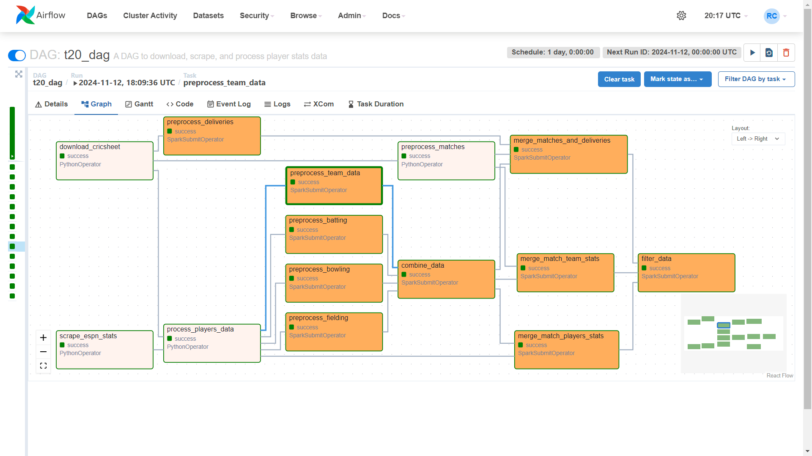

# T20 Cricket Win Prediction Project

This project aims to predict the probability of a T20 cricket team winning at any given point in a match. By incorporating this model into a cricket app, we can attract more viewers by providing real-time predictions and insights during live matches. The solution uses a combination of **RNNs, CNNs, and DNNs** for analyzing sequential data (ball-by-ball), player statistics, and team-level statistics, respectively. These models are integrated into a deep neural network that yields real-time predictions. The final model is deployed as part of a portfolio site, with results showcased through visualizations and snapshots.

## Table of Contents

- [Overview](#overview)
- [Directory Structure](#directory-structure)
- [Data Processing Pipeline](#data-processing-pipeline)
- [Modeling Approach](#ml-modeling-approach)
- [Deployment](#deployment)
- [Getting Started](#getting-started)
- [Future Enhancements](#future-enhancements)
- [Conclusion](#conclusion)

## Overview

The goal of this project is to provide **real-time predictions** on the likelihood of a team winning a T20 match, based on:

**Encoder**
- **Ball-by-Ball Sequences**: Utilizes an RNN to process the temporal sequence of game events.
- **Player Statistics**: Uses a CNN to capture player performance features.
- **Team Statistics**: Uses a DNN to aggregate overall team stats.
  
**Decoder**
  
These models are trained independently and then merged into a final DNN for comprehensive predictions.

## Directory Structure

Here's a high-level structure of the project folders:

```plaintext
├── data                     # This directory is present in HDFS (Get by running Pipeline)
│   ├── 1_rawData            # Raw cricket data sources (ball-by-ball and player/team stats)
│   ├── 2_processedData      # Processed batting, bowling, fielding CSVs
│   ├── 3_aftermerging       # Data after merging individual stats
│   └── 4_filteredData       # Filtered data for modeling
├── data_pipelines           # ETL pipeline in Airflow for data ingestion and processing
│   ├── a_data_sources
│   ├── b_data_preprocessing
│   ├── c_data_merging
│   ├── d_data_filtering
│   └── dags                 # Airflow DAGs
├── data_manuplation         # Spark scripts for preprocessing, EDA, merging, and filtering data
│   ├── 1_preprocessing
│   ├── 2_eda
│   ├── 3_mergers
│   └── 4_filteringData
└── ml_modeling              # Training, evaluation, and hyperparameter tuning
    ├── 1_labeling
    ├── 2_naivetraining
    ├── 3_evaluating
    ├── 4_hptuning
    ├── 5_specialEvaluation
```

## Tech Stack

The project utilizes the following technologies:

- **Python**: Programming language for data processing and machine learning.
- **PyTorch**: Deep learning framework for building and training models.
- **Apache Spark**: Big data processing for data manipulation tasks.
- **Apache Airflow**: Workflow management for orchestrating data pipelines.
- **Hadoop HDFS**: Distributed file system for storing datasets.
- **Conda**: Environment management for package and dependency handling.
- **Jupyter Notebooks**: Interactive development environment for code and documentation.
- **Git**: Version control system for tracking changes in the codebase.
- **WandB**: Experiment Tracking, Hyperparameter tuning

## Data Processing Pipeline

The data processing pipeline consists of multiple stages and is orchestrated using **Apache Airflow**:

1. **Data Collection**: Pulls raw data from sources (e.g., Cricsheet) and ESPN cricket stats.
2. **Data Preprocessing**: Cleans and transforms raw data for player and team stats.
3. **Data Merging**: Combines individual datasets for player, team, and ball-by-ball statistics.
4. **Data Filtering**: Filters datasets for model training, focusing on relevant features to remove matches that are not in all 3 datasets (player, team, and ball-by-ball).

### Pipeline Diagram

The entire data pipeline is visualized in Airflow, with each step from data extraction to filtering organized as individual tasks.




## Ml modeling Approach

This solution employs a sophisticated **multi-model architecture**:

1. **RNN for Sequence**: Processes ball-by-ball data to capture temporal match dynamics.
2. **CNN for Player Stats**: Extracts features from player statistics, taking advantage of CNNs for feature aggregation.
3. **DNN for Team Stats**: Processes high-level team statistics for match conditions and overall team strength.
4. **Ensemble Model (DNN)**: Combines outputs from the RNN, CNN, and team DNN into a final DNN that predicts win probability.

*pytorchData is ignored due to large data size run \training\labeling\datasetpreparation.ipynb  file to get those files*


### Training Steps

1. Initial labeling and data preparation.
2. Naive training to test baseline model performance.
3. Evaluation and metrics analysis.
4. Hyperparameter tuning and additional evaluations.
5. Selecting best model from wandb sweep

### Results
The final model achieved an accuracy of 85% on the test set, with a tested accross different overs


## Deployment

This model is deployed in a **portfolio website** as part of a static visual showcase rather than a live API to manage server costs. Users can view snapshots of model results and visualizations of prediction accuracy, as running real-time predictions requires constant data streaming, which would increase infrastructure costs.

## Getting Started

I am currently ```dockerizing``` the pipline for getting easy to start. If you want to run locally follow steps below

### Prerequisites

1. Install **Apache Airflow**, **Spark**, and **Hadoop** for managing the data pipeline.
2. Ensure Python dependencies are installed using `requirements.txt`. or use the following command
```Code
    conda env create -f conda-env.yaml
```
3. Set up **Airflow** and **HDFS** connections in your environment configuration. and change configuration in ```/data_pipelines/config.py```

### Run Pipeline

1. **Configure Airflow DAG**: Update the Airflow connection settings for `spark_default` and `hdfs_default`.
2. **Run Pipeline**: Start Airflow and trigger the pipeline to process and transform cricket data.
3. **Train Models**: Use the notebooks and scripts in `training` to train the RNN, CNN, and DNN models.
4. **Deployment**: Push results to the portfolio for visualization.

## Future Enhancements

1. **Live API**: Introduce a server that ingests real-time match data for live prediction capabilities.
2. **Advanced Model Tuning**: Explore ```ensemble techniques``` or enhace feature engineering using ```Domain Knowledge``` for enhanced predictions.
3. **Visual Dashboard**: Develop a dynamic dashboard to visualize ongoing predictions in a user-friendly format.

## Conclusion

This project showcases a comprehensive method for predicting the outcome of T20 cricket matches by utilizing an encoder-decoder architecture and integrating multiple machine learning models. By employing industry-standard tools like Hadoop HDFS, Apache Airflow, Apache Spark, PyTorch, and Weights & Biases (wandb), we've created a robust pipeline capable of handling large datasets and delivering real-time predictions. Incorporating this model into a cricket app can enhance user engagement by providing insightful analytics and live win probabilities.
