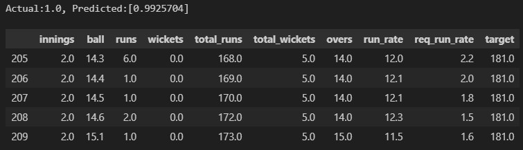
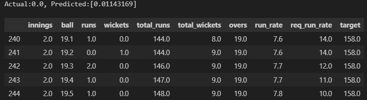

# T20 Cricket Win Prediction Project


## Overview

The **T20 Cricket Win Prediction Project** leverages advanced machine learning techniques to predict the probability of a T20 cricket team winning at any given point in a match. By integrating this model into a cricket application, we aim to enhance viewer engagement through insightful analytics based on static predictions.

## Table of Contents

- [Overview](#overview)
- [Tech Stack](#tech-stack)
- [Directory Structure](#directory-structure)
- [Data Processing Pipeline](#data-processing-pipeline)
- [Modeling Approach](#modeling-approach)
- [Results](#results)
- [Deployment](#deployment)
- [Getting Started](#getting-started)
- [Future Enhancements](#future-enhancements)
- [Conclusion](#conclusion)

## Tech Stack

- **Programming Language**: Python
- **Machine Learning Framework**: PyTorch
- **Data Processing**: Apache Spark, Apache Airflow
- **Storage**: Hadoop HDFS
- **Environment Management**: Conda
- **Experiment Tracking**: Weights & Biases (WandB)
- **Containerization**: Docker
- **Visualization**: Jupyter Notebooks, Matplotlib, Seaborn
- **Version Control**: Git

## Directory Structure

Here's a high-level structure of the project folders, indicating completed and pending steps:

```plaintext
.
├── Dockerfile
├── README.md
├── airflow.cfg
├── airflow_settings.yaml
├── apps
├── configs
│   ├── hp_config.yaml
│   └── spark_config.py
├── dags
│   └── t20.py
├── data_manuplation
│   ├── 1_preprocessing
│   ├── 2_eda
│   ├── 3_mergers
│   └── 4_filteringData
├── docker-compose.override.yml
├── include
│   ├── a_data_sources
│   ├── b_data_preprocessing
│   ├── c_data_merging
│   └── d_data_filtering
├── ml_modeling
│   ├── 1_data_preparation
│   ├── 2_naivetraining
│   ├── 3_augumented_training
│   ├── 4_hptuning
│   └── 5_selecting_best_model_to_onnx
├── public
├── requirements.txt
├── utils
└── ...
```

## Data Processing Pipeline

The data processing pipeline consists of multiple stages and is orchestrated using **Apache Airflow**:

1. **Data Collection**: Pulls raw data from sources (e.g., Cricsheet) and ESPN cricket stats.
2. **Data Preprocessing**: Cleans and transforms raw data for player and team stats.
3. **Data Merging**: Combines individual datasets for player, team, and ball-by-ball statistics.
4. **Data Filtering**: Filters datasets for model training, focusing on relevant features to remove matches that are not in all 3 datasets (player, team, and ball-by-ball).

### Pipeline Diagram

The entire data pipeline is visualized in Airflow, with each step from data extraction to filtering organized as individual tasks.


## Modeling Approach

This solution employs a sophisticated **multi-model architecture**:

1. **RNN for Sequence**: Processes ball-by-ball data to capture temporal match dynamics.
2. **CNN for Player Stats**: Extracts features from player statistics, taking advantage of CNNs for feature aggregation.
3. **DNN for Team Stats**: Processes high-level team statistics for match conditions and overall team strength.
4. **Ensemble Model (DNN)**: Combines outputs from the RNN, CNN, and team DNN into a final DNN that predicts win probability.

*pytorchData is ignored due to large data size run \training\labeling\datasetpreparation.ipynb  file to get those files*

### Training Steps

1. Initial labeling and data preparation.
2. Naive training to test baseline model performance.
3. Evaluation and metrics analysis.
4. Hyperparameter tuning and additional evaluations.
5. Selecting best model from wandb sweep and converting to onnx

### Results
The final model achieved an accuracy of 85% on the test set, which is tested across different overs


Win Example



Loss Example



## Deployment

Instead of deploying the model as a live service, the project is fully dockerized to allow others to start development easily without incurring high costs. This approach provides an isolated environment for testing and experimentation.

## Getting Started

To run this project locally, follow the steps below:

### Prerequisites

1. **Create the Conda environment** using the provided `environment.yml` file:

    ```bash
    conda env create -f environment.yml
    ```

2. **Activate the environment**:

    ```bash
    conda activate huggingface-torch
    ```

### Running the Pipeline

1. **Start Airflow**: Navigate to the project directory and run:

    ```bash
    astro dev start
    ```

2. **Trigger the Pipeline**: Access the Airflow webserver and start the `t20` DAG to process and transform cricket data. Make sure you have the container running like below.


### Training the Models

1. **Run Training Scripts**: Navigate to the `ml_modeling` directory and execute:

    ```bash
    python 2_naivetraining/train.py
    ```
    - **Warning**: Ensure you have your `wandb API key` set in your environment variables.

### Development Environment Setup

Ensure you have Docker installed to run the containerized environment, simplifying the setup process for development.

## Future Enhancements

1. **Live API**: Introduce a server that ingests real-time match data for live prediction capabilities.
2. **Advanced Model Tuning**: Explore `ensemble techniques` or enhance feature engineering using `Domain Knowledge` for improved predictions.
3. **Visual Dashboard**: Develop a dynamic dashboard to visualize ongoing predictions in a user-friendly format.

## Conclusion

This project showcases a comprehensive method for predicting the outcome of T20 cricket matches by utilizing an encoder-decoder architecture and integrating multiple machine learning models. By employing industry-standard tools like Hadoop HDFS, Apache Airflow, Apache Spark, PyTorch, and Weights & Biases (wandb), along with dockerization for easy development, we've created a robust pipeline capable of handling large datasets. Incorporating this model into a cricket app can enhance user engagement by providing insightful analytics and live win probabilities in future deployments.
